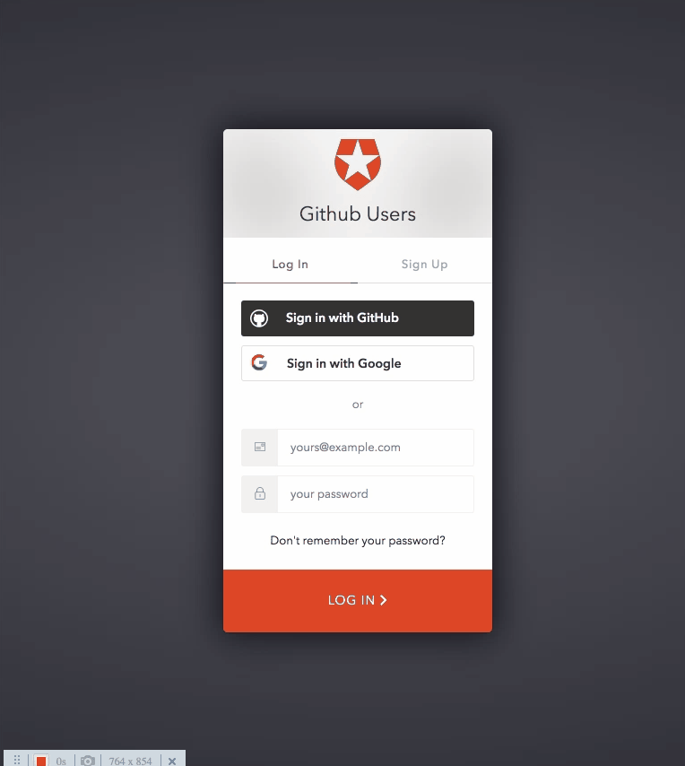

<h1 align="center">
    
</h1>
<h1 align="center">
    
</h1>
<h1 align="center">
    
</h1>
<h1 align="center">
    
</h1>

## 💻 About project

Personal project built to search every github profile you want and get useful data from it. First, you have to login/sign up to use the application. The authentication is made through Auth0.com. When you finally login in the application, it will be displayed for you a search bar to search for github profiles. When you search for a github profile, it will display some data from that profile, like:

-   Number of Repositories, followers, following and gists;
-   Profile with avatar image, description, blog url, company, place;
-   Useful charts about popular repositories, languages most used, stars by language and forks.

You can access the github profile clicking over 'Follow' button and Logout from the application through the button in the Navbar section. With the github API, you can make 60 request per hour, so inside the application you have access about how many requests you can do and how many you did. Also, whenever you access a wrong path in the application, you are redirected to a "Error" page, where you can back home.

## 🛠 Technology

#### **Website**

-   **[HTML5](https://developer.mozilla.org/pt-BR/docs/Web/HTML/HTML5)**
-   **[CSS3](https://www.w3schools.com/css/)**
-   **[ReactJs](https://pt-br.reactjs.org/)** : **[Styled-Components](https://styled-components.com/)**, **[React Icons](https://react-icons.github.io/react-icons/)**, **[react-router-dom](https://reactrouter.com/web/guides/quick-start)**, **[React Hooks](https://pt-br.reactjs.org/docs/hooks-intro.html)**, **[Context](https://pt-br.reactjs.org/docs/context.html)**.
-   **[Axios](https://www.npmjs.com/package/axios)**

#### **Utilitaries**

-   Editor: **[Visual Studio Code](https://code.visualstudio.com/)**
-   API: **[Github API](https://developers.themoviedb.org/3/movies)**
    -   **[Root Endpoint](https://api.github.com)**
    -   **[Get User](https://api.github.com/users/wesbos)**
    -   **[Repos](https://api.github.com/users/john-smilga/repos?per_page=100)**
    -   **[Followers](https://api.github.com/users/john-smilga/followers)**
    -   **[Rate Limit](https://api.github.com/rate_limit)**
-   Charts: **[Fusion Charts](https://www.fusioncharts.com/)**
-   Authentication for Login/Logout: **[Auth0](https://auth0.com/)**

### Prerequisites

Before you begin, you will need to have the following tool installed on your machine:
[Git](https://git-scm.com)

In addition, it is good to have an editor to work with the code as **[VSCode](https://code.visualstudio.com/)**

### Running the web application (Front End)

```bash
# Clone this repository
$ git clone https://github.com/luizmr/github-datafinder-app.git

# Access the project folder in the cmd/terminal
$ cd github-datafinder-app

# Use the command below to install all dependencies
$ npm install

# Install http-server
$ npx http-server

# Run the application on terminal
$ npm start

# The server is now running at localhost:3000
```

## 📝 License

This project is under the MIT license.

Made with ❤️ by Luiz Marcelo Rocha
